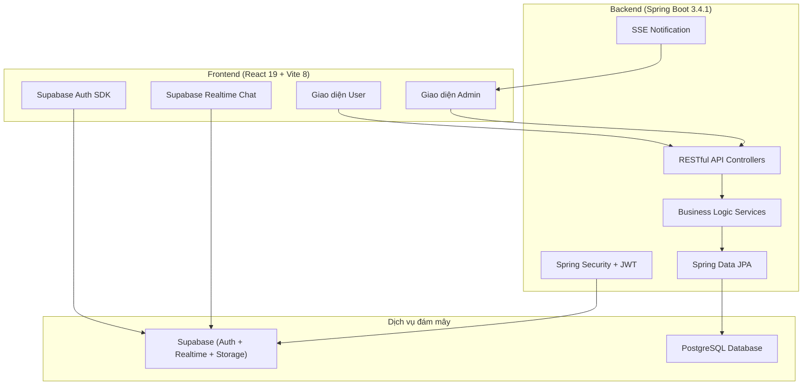
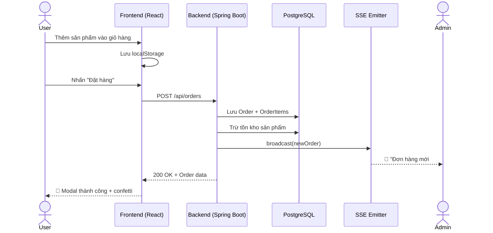
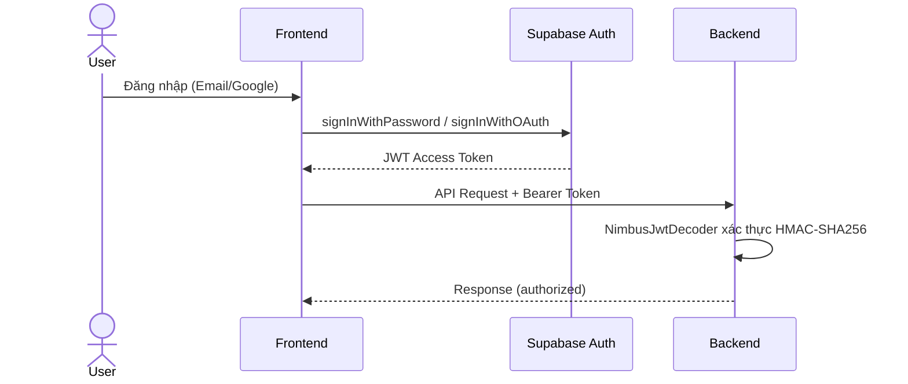

#  BÁO CÁO TÓM TẮT DỰ ÁN FARMILY

> **Đồ án Web** — Website bán rau củ quả sạch trực tuyến  
> **Tác giả:** Chu Toàn Đức (Nhóm trưởng) & Nguyễn Thái Bảo  
> **Ngày báo cáo:** 04/06/2026

---

## 1. TỔNG QUAN DỰ ÁN

### 1.1 Mô tả
**Farmily** là nền tảng thương mại điện tử full-stack chuyên bán rau củ quả sạch, kết nối trực tiếp nông trại đạt chuẩn VietGAP & GlobalGAP đến người tiêu dùng, loại bỏ khâu trung gian.

### 1.2 Kiến trúc hệ thống



### 1.3 Phân công thành viên

| Thành viên | Vai trò | Phân công chính |
|---|---|---|
| **Chu Toàn Đức** | Fullstack & System Architect | Backend API, Spring Security + JWT, SSE Notification, CSDL, kiến trúc hệ thống |
| **Nguyễn Thái Bảo** | Frontend Developer & UI/UX | Giao diện React (User & Admin), Tailwind CSS 4, Framer Motion, tích hợp Supabase Client SDK, Recharts |

---

## 2. CÔNG NGHỆ & KỸ THUẬT SỬ DỤNG

### 2.1 Frontend

| Công nghệ | Phiên bản | Vai trò |
|---|---|---|
| **React** | 19.2.4 | Thư viện UI component-based |
| **Vite** | 8.0.1 | Build tool & dev server |
| **Tailwind CSS** | 4.2.2 | Utility-first CSS framework |
| **Framer Motion** | 12.38.0 | Animation & page transitions |
| **React Router DOM** | 7.14.1 | Client-side routing (SPA) |
| **Recharts** | 3.8.1 | Biểu đồ thống kê cho Admin Dashboard |
| **Supabase JS** | 2.103.0 | Auth SDK & Realtime client |
| **Lucide React** | 1.8.0 | Icon library |
| **React Hot Toast** | 2.6.0 | Toast notifications |
| **date-fns** | 4.1.0 | Xử lý ngày tháng |
| **canvas-confetti** | 1.9.4 | Hiệu ứng confetti khi đặt hàng thành công |

### 2.2 Backend

| Công nghệ | Phiên bản | Vai trò |
|---|---|---|
| **Java** | 17 | Ngôn ngữ lập trình |
| **Spring Boot** | 3.4.1 | Web framework |
| **Spring Data JPA** | — | ORM & data access |
| **Spring Security** | — | Bảo mật & phân quyền |
| **OAuth2 Resource Server** | — | Giải mã & xác thực JWT từ Supabase |
| **PostgreSQL Driver** | — | Kết nối CSDL |
| **Lombok** | — | Giảm boilerplate code |
| **dotenv-java** | 3.0.0 | Quản lý biến môi trường |

### 2.3 Dịch vụ đám mây (BaaS)

| Dịch vụ | Chức năng |
|---|---|
| **Supabase Authentication** | Đăng ký/đăng nhập Email + Google OAuth 2.0 |
| **Supabase Realtime** | WebSocket chat hỗ trợ khách hàng |
| **Supabase Storage** | Lưu trữ ảnh sản phẩm qua CDN |
| **PostgreSQL (Supabase)** | Cơ sở dữ liệu quan hệ |

---

## 3. CÁC KỸ THUẬT NÂNG CAO ĐÃ ÁP DỤNG

### 3.1 Server-Sent Events (SSE) — Thông báo realtime
- Backend sử dụng `SseEmitter` (Spring MVC) để đẩy thông báo đơn hàng mới từ server đến trình duyệt Admin **tức thì, không cần reload**.
- Quản lý kết nối qua `CopyOnWriteArrayList` (thread-safe).
- Khi có đơn hàng mới → `NotificationService.broadcast(order)` → tất cả Admin client đang kết nối nhận event `newOrder`.

### 3.2 JWT Authentication + OAuth2 Resource Server
- Spring Security giải mã **JWT token do Supabase cấp** bằng `NimbusJwtDecoder` với HMAC-SHA256.
- Phân quyền role-based: `Admin` vs `User`.
- Hỗ trợ đăng nhập nhanh **Google OAuth 2.0** thông qua Supabase Auth.

### 3.3 Supabase Realtime Chat (WebSocket)
- Chat giữa User ↔ Admin đồng bộ tức thời qua **Supabase Realtime Database**.
- Admin nhận toast thông báo tin nhắn mới, có trạng thái "đã xem" (seen).

### 3.4 Single Page Application (SPA) với Page Transitions
- `React Router DOM 7` quản lý routing không reload trang.
- `AnimatePresence` + `motion.div` (Framer Motion) tạo hiệu ứng chuyển trang mượt mà.
- Giỏ hàng lưu **localStorage** → dữ liệu giữ nguyên khi refresh.

### 3.5 Kiến trúc phân tầng Backend (Layered Architecture)

```
Controller → Service → Repository → Entity → PostgreSQL
     ↓
    DTO (Data Transfer Objects)
```

---

## 4. CẤU TRÚC MODULE CHI TIẾT

### 4.1 Frontend — Phía người dùng (22 components)

| Component | Chức năng |
|---|---|
| `HeroSection` | Banner trang chủ với animation |
| `StorySection` | Câu chuyện thương hiệu Farmily |
| `Shop` | Danh sách sản phẩm, lọc danh mục, tìm kiếm |
| `ProductCard` | Card hiển thị sản phẩm |
| `ProductDetail` | Chi tiết sản phẩm (modal overlay) |
| `ProductReviews` | Hiển thị & viết đánh giá sản phẩm |
| `CartSidebar` | Sidebar giỏ hàng (slide-in) + thanh tiến trình freeship |
| `Checkout` | Trang thanh toán, áp mã khuyến mãi |
| `SuccessModal` | Modal đặt hàng thành công + confetti |
| `OrderHistory` | Lịch sử đơn hàng + theo dõi trạng thái |
| `ReturnRequestModal` | Modal yêu cầu hoàn hàng |
| `UserProfile` | Quản lý hồ sơ cá nhân |
| `AuthModal` | Đăng ký / Đăng nhập (Email + Google) |
| `ResetPassword` | Đặt lại mật khẩu |
| `ChatWidget` | Chat hỗ trợ realtime |
| `Navbar` | Thanh điều hướng |
| `Footer` | Footer thông tin |
| `SalesNotification` | Thông báo bán hàng tự động |
| `PromotionsUser` | Trang khuyến mãi người dùng |
| `PromotionCard` | Card hiển thị voucher |
| `PromotionBanner` | Banner khuyến mãi |
| `PromotionFilter` | Bộ lọc khuyến mãi |

### 4.2 Frontend — Phía quản trị Admin (10 trang)

| Trang | Chức năng |
|---|---|
| `Dashboard` | Tổng quan: doanh thu, đơn hàng, biểu đồ Recharts |
| `Products` | CRUD sản phẩm (ảnh, giá, tồn kho, tags) |
| `Categories` | Quản lý danh mục sản phẩm |
| `Orders` | Quản lý đơn hàng & cập nhật trạng thái |
| `Customers` | Danh sách khách hàng |
| `Promotions` | CRUD khuyến mãi / voucher giảm giá |
| `Reports` | Báo cáo thống kê doanh số |
| `Accounts` | Quản lý tài khoản |
| `ChatSupport` | Chat hỗ trợ khách hàng (realtime) |
| `Returns` | Xử lý yêu cầu hoàn hàng / khiếu nại |

> Hỗ trợ **Dark Mode** đồng bộ toàn bộ giao diện Admin.

### 4.3 Backend — JPA Entities (11 bảng dữ liệu)

| Entity | Mô tả |
|---|---|
| `User` | Thông tin tài khoản |
| `Profile` | Hồ sơ cá nhân mở rộng |
| `Product` | Sản phẩm rau củ quả |
| `Category` | Danh mục sản phẩm |
| `Order` | Đơn hàng |
| `OrderItem` | Chi tiết từng mục trong đơn hàng |
| `OrderTracking` | Theo dõi trạng thái vận chuyển |
| `Review` | Đánh giá & nhận xét sản phẩm |
| `Promotion` | Chương trình khuyến mãi / voucher |
| `ReturnRequest` | Yêu cầu hoàn hàng |
| `ReturnRequestItem` | Chi tiết sản phẩm hoàn trả |

### 4.4 Backend — REST Controllers (9 endpoints group)

| Controller | API Prefix | Chức năng |
|---|---|---|
| `ProductController` | `/api/products` | CRUD sản phẩm, phân trang, tìm kiếm |
| `CategoryController` | `/api/categories` | CRUD danh mục |
| `OrderController` | `/api/orders` | Tạo đơn, cập nhật trạng thái, lịch sử |
| `ProfileController` | `/api/profiles` | Quản lý hồ sơ người dùng |
| `PromotionController` | `/api/promotions` | CRUD khuyến mãi, áp mã giảm giá |
| `ReviewController` | `/api/reviews` | CRUD đánh giá sản phẩm |
| `ReturnRequestController` | `/api/returns` | Yêu cầu hoàn hàng |
| `DashboardController` | `/api/admin/dashboard` | Thống kê tổng quan |
| `ReportController` | `/api/admin/reports` | Báo cáo doanh số |

---

## 5. KẾT QUẢ THỰC HIỆN

### 5.1 Các tính năng đã hoàn thành

####  Phía người dùng (Customer)
| # | Tính năng | Trạng thái |
|---|---|---|
| 1 | Trang chủ với Hero Section & câu chuyện thương hiệu | ✅ Hoàn thành |
| 2 | Duyệt & tìm kiếm sản phẩm theo danh mục | ✅ Hoàn thành |
| 3 | Xem chi tiết sản phẩm, đánh giá & nhận xét | ✅ Hoàn thành |
| 4 | Sản phẩm liên quan / cùng danh mục | ✅ Hoàn thành |
| 5 | Giỏ hàng (localStorage) & thanh toán | ✅ Hoàn thành |
| 6 | Áp dụng mã khuyến mãi khi thanh toán | ✅ Hoàn thành |
| 7 | Lịch sử đơn hàng & theo dõi trạng thái | ✅ Hoàn thành |
| 8 | Yêu cầu hoàn hàng / khiếu nại | ✅ Hoàn thành |
| 9 | Xem khuyến mãi đang diễn ra | ✅ Hoàn thành |
| 10 | Quản lý hồ sơ cá nhân | ✅ Hoàn thành |
| 11 | Chat realtime với nhân viên hỗ trợ | ✅ Hoàn thành |
| 12 | Đăng ký / Đăng nhập (Email + Google OAuth) | ✅ Hoàn thành |
| 13 | Quên mật khẩu & đặt lại mật khẩu | ✅ Hoàn thành |
| 14 | Thông báo bán hàng tự động | ✅ Hoàn thành |

#### Phía quản trị (Admin)
| # | Tính năng | Trạng thái |
|---|---|---|
| 1 | Dashboard tổng quan (biểu đồ Recharts) | ✅ Hoàn thành |
| 2 | CRUD sản phẩm (ảnh Supabase Storage) | ✅ Hoàn thành |
| 3 | Quản lý danh mục | ✅ Hoàn thành |
| 4 | Quản lý đơn hàng & cập nhật trạng thái | ✅ Hoàn thành |
| 5 | Quản lý khách hàng | ✅ Hoàn thành |
| 6 | Quản lý khuyến mãi / voucher | ✅ Hoàn thành |
| 7 | Báo cáo thống kê | ✅ Hoàn thành |
| 8 | Quản lý tài khoản | ✅ Hoàn thành |
| 9 | Chat hỗ trợ khách hàng (realtime) | ✅ Hoàn thành |
| 10 | Xử lý hoàn hàng / khiếu nại | ✅ Hoàn thành |
| 11 | Dark Mode | ✅ Hoàn thành |
| 12 | Thông báo realtime đơn hàng mới (SSE) | ✅ Hoàn thành |

### 5.2 Điểm nổi bật (Highlights)

| Tiêu chí | Chi tiết |
|---|---|
|  **UI/UX hiện đại** | Glassmorphism, micro-animations (Framer Motion), responsive toàn bộ, Light/Dark Mode |
| ⚡ **Realtime đa kênh** | SSE cho thông báo đơn hàng + WebSocket (Supabase) cho chat → phản hồi tức thì |
|  **Bảo mật JWT** | Supabase cấp token → Spring Security xác thực HMAC-SHA256 + phân quyền role-based |
|  **SPA mượt mà** | Chuyển trang không reload + hiệu ứng transition |
|  **Dashboard trực quan** | Biểu đồ cột, đường bằng Recharts; dữ liệu thực từ database |
|  **Containerized** | Dockerfile sẵn sàng deploy lên Render/Cloud |

### 5.3 Quy mô source code

| Thành phần | Số lượng |
|---|---|
| Frontend Components (User) | 22 files |
| Frontend Pages (Admin) | 10 files |
| Backend Entities | 11 files |
| Backend Controllers | 9 files |
| Backend Services | 4 files |
| Config classes | 2 files |
| Tổng commits (Git) | ~60+ commits, 32 Pull Requests |

---

## 6. SƠ ĐỒ LUỒNG NGHIỆP VỤ CHÍNH

### 6.1 Luồng đặt hàng



### 6.2 Luồng xác thực



---

## 7. KẾT LUẬN

Dự án **Farmily** đã hoàn thành đầy đủ các yêu cầu của một ứng dụng thương mại điện tử hiện đại với:

- **26+ tính năng** hoàn chỉnh cho cả User và Admin
- **Kỹ thuật nâng cao**: SSE realtime, JWT authentication, WebSocket chat, SPA transitions
- **Giao diện chuyên nghiệp** với dark mode, micro-animations, responsive design
- **Kiến trúc sạch** theo mô hình phân tầng, dễ bảo trì và mở rộng
- **Triển khai được** với Docker, sẵn sàng deploy lên cloud
