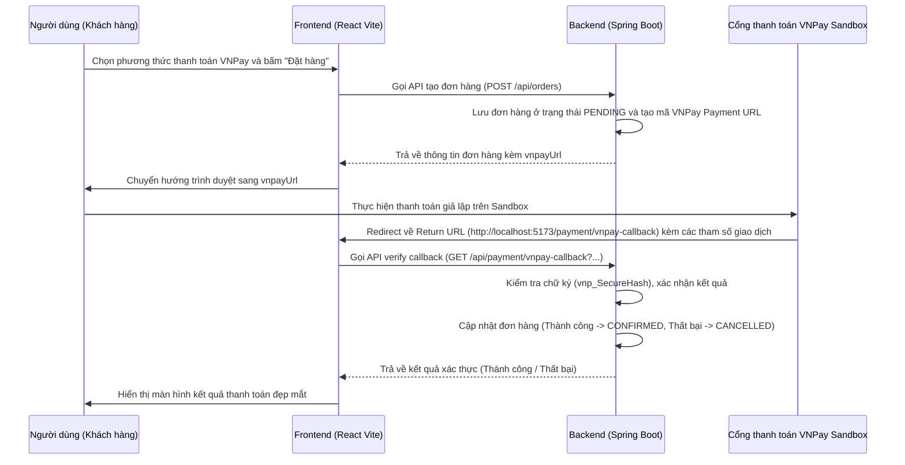

# Kế hoạch Tích hợp Thanh toán VNPay Sandbox

Tài liệu này chi tiết các bước cần thực hiện để tích hợp cổng thanh toán **VNPay Sandbox** vào dự án **WebRauCuQua**.

---

## 🏗️ Tổng quan Quy trình (Payment Flow)



---

## 🛠️ Chi tiết các thay đổi

### 1. Phần Backend (Spring Boot)

#### 📝 Cấu hình `application.properties` và `.env`
*   **Mục tiêu**: Định nghĩa các hằng số kết nối tới VNPay Sandbox.
*   **Khóa cấu hình**:
    *   `vnpay.tmn-code` (mã website)
    *   `vnpay.hash-secret` (chuỗi bảo mật dùng tạo checksum)
    *   `vnpay.pay-url` (`https://sandbox.vnpayment.vn/paymentv2/vpcpay.html`)
    *   `vnpay.return-url` (`http://localhost:5173/payment/vnpay-callback`)

#### 📝 Cập nhật Entity `Order.java`
*   **Mục tiêu**: Thêm thuộc tính `@Transient String paymentUrl` để trả về đường dẫn thanh toán cho client mà không lưu vào DB.

#### 📝 Cập nhật Repository `OrderRepository.java`
*   **Mục tiêu**: Thêm phương thức tìm kiếm đơn hàng bằng mã code:
    ```java
    Optional<Order> findByOrderCode(String orderCode);
    ```

#### 📝 Tạo class cấu hình `VNPayConfig.java`
*   **Mục tiêu**: Chứa các hàm tạo mã Hash SHA512, lấy địa chỉ IP của client, và định cấu hình môi trường VNPay.

#### 📝 Tạo class dịch vụ `VNPayService.java`
*   **Mục tiêu**: Chứa logic sinh URL thanh toán từ thông tin đơn hàng và xác thực dữ liệu trả về từ VNPay.

#### 📝 Cập nhật `OrderController.java`
*   **Mục tiêu**: Khi tạo đơn hàng thành công, nếu phương thức thanh toán là `vnpay`, gán giá trị `paymentUrl` tạo từ `VNPayService` vào đối tượng `Order` trước khi trả về.

#### 📝 Tạo controller mới `PaymentController.java`
*   **Mục tiêu**: Định nghĩa API callback `/api/payment/vnpay-callback` để nhận dữ liệu từ VNPay, xác thực chữ ký và cập nhật trạng thái đơn hàng.

#### 📝 Cập nhật cấu hình bảo mật `SecurityConfig.java`
*   **Mục tiêu**: Cho phép truy cập không cần xác thực (PermitAll) đến các API `/api/payment/**` để VNPay có thể chuyển hướng và callback.

---

### 2. Phần Frontend (React Vite)

#### 📝 Cập nhật `Checkout.jsx`
*   **Mục tiêu**:
    *   Thêm tuỳ chọn phương thức thanh toán "VNPAY" vào danh sách hiển thị.
    *   Xử lý sau khi gọi API tạo đơn hàng thành công: Nếu có trường `paymentUrl` trả về, thực hiện chuyển hướng `window.location.href = result.paymentUrl`.

#### 📝 Tạo component mới `VNPayCallback.jsx`
*   **Mục tiêu**: Màn hình hiển thị kết quả giao dịch.
    *   Lấy các tham số từ URL (`vnp_ResponseCode`, `vnp_TxnRef`, v.v.).
    *   Gửi yêu cầu lên backend xác thực giao dịch qua API `/api/payment/vnpay-callback`.
    *   Xóa giỏ hàng local nếu giao dịch thành công.
    *   Hiển thị giao diện Premium & Dynamic (hiệu ứng Lottie/Framer Motion, màu sắc hài hòa) thông báo trạng thái thanh toán.

#### 📝 Cập nhật định tuyến `App.jsx`
*   **Mục tiêu**: Khai báo route mới cho màn hình kết quả thanh toán:
    ```jsx
    <Route path="/payment/vnpay-callback" element={<VNPayCallback />} />
    ```
